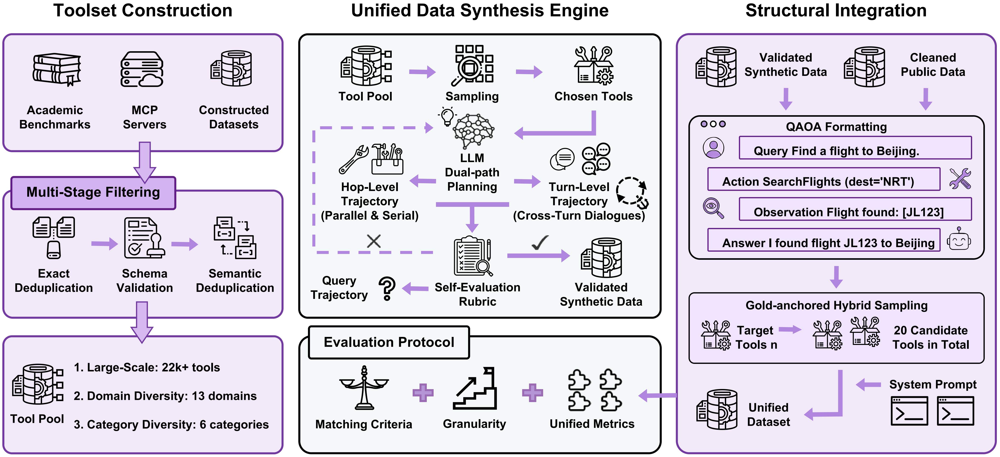
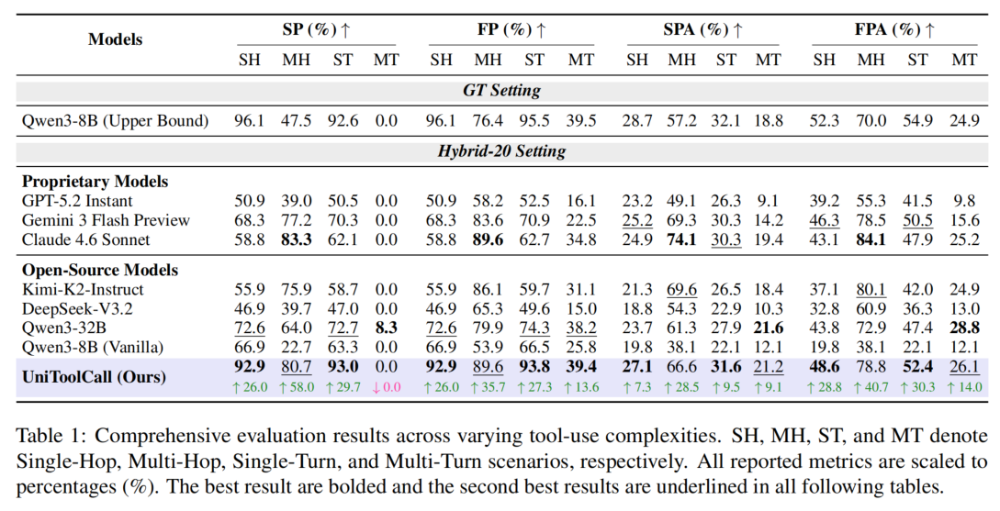

<p align="center">
  
</p>

<h1 align="center">UniToolCall: Unifying Tool-Use Representation, Data, and Evaluation for LLM Agents</h1>

**Languages / 语言:** **English** | [简体中文](README.zh-CN.md)

## 🚀Overview

Tool-use capability enables large language model (LLM) agents to interact with external systems through structured tool calls. However, existing work often uses **inconsistent interaction representations**, pays **too little attention to the structural distribution** of tool-use trajectories, and relies on **incompatible evaluation benchmarks**. **UniToolCall** is a **unified framework for tool learning** that standardizes the full pipeline—from toolset construction and dataset generation to evaluation.

The framework curates a tool pool of **22k+** tools and a hybrid training corpus of **390k+** instances, combining **10** standardized public datasets with structurally controlled synthetic trajectories covering **single-hop, multi-hop, single-turn, and multi-turn** interactions, explicitly modeling **serial and parallel** execution, and introducing an **Anchor Linkage** mechanism for multi-turn interactions to enforce cross-turn dependencies. We further convert **7** public benchmarks into a unified **Query-Action-Observation-Answer (QAOA)** representation with fine-grained evaluation at the **function-call, turn, and conversation** levels.

<p align="center">
  
</p>

## 🧠Performance

Experiments show that fine-tuning **Qwen3-8B** on our dataset substantially improves tool-use performance. Under the distractor-heavy **Hybrid-20** setting, UniToolCall achieves **93.0%** single-turn **Strict Precision**, outperforming **Qwen3-32B** by **20.3** points. The figure below summarizes evaluation results.

<p align="center">
  
</p>

## ✨Dataset

Training data has **two parts**: (1) **public-converted** data, and (2) **pipeline-generated** data.

The full public-converted release is on Hugging Face:

**[huggingface.co/datasets/EIT-NLP/UniToolCall](https://huggingface.co/datasets/EIT-NLP/UniToolCall)**

Pipeline-generated datasets in this repository:

`multi-hop_pipeline/data/`, `multi-turn_pipeline/data/`, and `single-hop_pipeline/data/`

## 🔧Toolset

Tool list used to build training data:

`tool_set/apis/toolset.json`

## 🌍Requirements

- **Python** `>=3.9` (see [`pyproject.toml`](pyproject.toml)).
- Third-party packages are listed in [`requirements.txt`](requirements.txt) and mirrored under `[project]` / `dependencies` in [`pyproject.toml`](pyproject.toml).

## 🧪Installation

```bash
cd UniToolCall
pip install -r requirements.txt
pip install -e .
```

## 🌟Inference and evaluation

Scripts live under `test_set/scripts/metrics/`. Configure **API keys** via **environment variables** first.

### Inference

From the repository root:

```bash
cd test_set/scripts/metrics
python generate_with_qwen_server_list.py
```

Typical example:

```bash
# api1 = SiliconFlow; api2 = OpenAI; api3 = Anthropic; api4 = Gemini; server/sft = local vLLM
python generate_with_qwen_server_list.py --mode api1 \
  --inputfile /path/to/benchmark_json_dir \
  --outputfile /path/to/predictions_dir
```

### Evaluation

```bash
cd test_set/scripts/metrics
python all_evaluation.py
```

Batch evaluation:

```bash
python all_evaluation.py \
  --inputfile /path/to/predictions_dir \
  --outputfile /path/to/eval_results_dir \
  --gtfile /path/to/gt_json_dir
```

**Dataset-construction pipelines** live under `multi-hop_pipeline/scripts/`, `multi-turn_pipeline/scripts/`, and `single-hop_pipeline/scripts/`; run from that directory, e.g. `cd multi-hop_pipeline/scripts && python generate_via_api.py`.

## 🎯Repository layout

| Path | Description |
|------|-------------|
| `multi-hop_pipeline/` | Multi-hop trajectory generation, QC, augment, **standardization** |
| `multi-turn_pipeline/` | Multi-turn generation and **standardization** |
| `single-hop_pipeline/` | Single-hop data utilities |
| `test_set/` | Benchmarks |
| `tool_set/` | Tool corpus |
| `train_set/` | Training-data preparation |
| `src/uni_toolcall/` | Shared package (`paths`, `prompts`, `secrets`) |

**Pipeline** folders (`*_pipeline/`) usually contain `prompts/` and `outputs/`. `multi-hop_pipeline/` may also include `db/` (e.g. `usage_stats.json` for sampling).

Under `train_set/scripts/` and `test_set/scripts/`, subfolders such as `convert/`, `analysis/`, `metrics/`, and `toollist/` group scripts by role.

## 👉License

See the [`LICENSE`](LICENSE) file in the repository root (Apache License 2.0).
